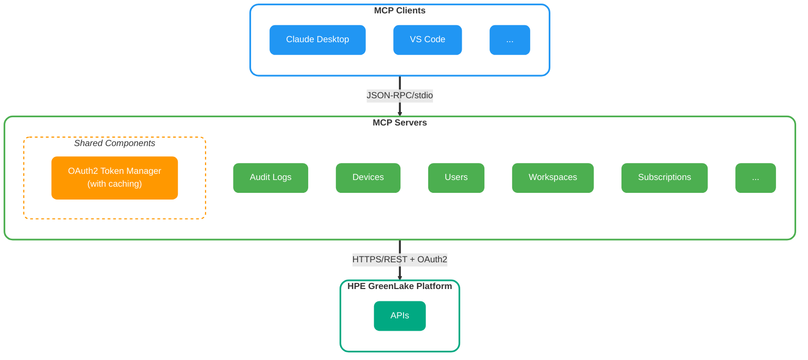

# HPE GreenLake MCP Servers

[](./LICENSE)
[](https://www.python.org/downloads/)
[](https://github.com/astral-sh/ruff)
[](https://github.com/HewlettPackard/gl-mcp/actions/workflows/ci-public.yml)


A collection of [Model Context Protocol (MCP)](https://modelcontextprotocol.io) servers that enable AI assistants to interact with HPE GreenLake platform services.

## Table of Contents

- [What is the Model Context Protocol?](#what-is-the-model-context-protocol)
- [What's in this Repository?](#whats-in-this-repository)
- [Available MCP Servers](#available-mcp-servers)
  - [Infrastructure & Platform Management](#infrastructure--platform-management)
  - [Security & Compliance](#security--compliance)
  - [User & Access Management](#user--access-management)
- [Quick Start](#quick-start)
- [MCP Client Configuration](#mcp-client-configuration)
- [Tool Modes](#tool-modes)
- [Architecture Overview](#architecture-overview)
- [Security Considerations](#security-considerations)
- [Troubleshooting](#troubleshooting)
- [Getting Help](#getting-help)
- [Resources](#resources)
- [License](#license)

## What is the Model Context Protocol?

The Model Context Protocol (MCP) is an open protocol that enables seamless integration between LLM applications and external data sources and tools.
Whether you're building an AI-powered IDE, enhancing a chat interface, or creating custom AI workflows, MCP provides a standardized way to connect LLMs with the context they need.

## What's in this Repository?

This repository contains production-ready MCP servers for HPE GreenLake platform services. Each server provides AI assistants with secure, read-only access to specific GreenLake APIs, enabling natural language interactions with your HPE infrastructure.

### Key Features

- **Standardized Architecture**: All servers follow consistent patterns for authentication, configuration, and error handling
- **OAuth2 Authentication**: Secure access using HPE GreenLake workspace credentials with automatic token management
- **Dual Tool Modes**: Each server supports both static (individual tools per endpoint) and dynamic (meta-tools) operation modes
- **Type-Safe**: Built with Pydantic models for runtime validation and type safety
- **Production Ready**: Comprehensive logging, error handling, and Docker support
- **Well Tested**: Extensive unit and integration test coverage

## Available MCP Servers

### Infrastructure & Platform Management

#### [Devices](./src/devices/README.md)

Manage and query HPE GreenLake devices in your workspace. Filter devices by type, serial number, tags, and other properties.

**Key Capabilities:**

- Retrieve device lists with advanced filtering
- Get detailed device information by ID
- Query devices by tags, device type, serial number, and more

#### [Workspaces](./src/workspaces/README.md)

Interact with HPE GreenLake workspace management APIs. View workspace details and manage workspace-level configurations.

**Key Capabilities:**

- List and query workspaces
- Retrieve workspace details and configurations
- Access workspace-level settings

#### [Subscriptions](./src/subscriptions/README.md)

Access subscription information and licensing details for your HPE GreenLake services.

**Key Capabilities:**

- View active subscriptions
- Query subscription details and licensing
- Monitor subscription status

### Security & Compliance

#### [Audit Logs](./src/audit-logs/README.md)

Query and analyze HPE GreenLake audit logs with powerful filtering capabilities.

**Key Capabilities:**

- Search audit logs by category, user, timestamp, and more
- Filter logs using advanced query operators (eq, contains, in)
- Retrieve detailed audit log information
- Track user activities and system events

### User & Access Management

#### [Users](./src/users/README.md)

Manage user accounts and access controls in HPE GreenLake workspaces.

**Key Capabilities:**

- List and query workspace users
- View user details and permissions
- Monitor user activity

## Quick Start

### Prerequisites

- Python 3.10 or higher
- [uv](https://github.com/astral-sh/uv) package manager
- HPE GreenLake workspace with API credentials

### Configuration

All servers require the following HPE GreenLake credentials:

```bash
export GREENLAKE_API_BASE_URL="https://global.api.greenlake.hpe.com"
export GREENLAKE_CLIENT_ID="your-client-id"
export GREENLAKE_CLIENT_SECRET="your-client-secret"
export GREENLAKE_WORKSPACE_ID="your-workspace-id"
```

### Running a Server

```bash
# Navigate to a server directory
cd src/audit-logs

# Install dependencies
uv sync

# Run the server
uv run python __main__.py
```

## MCP Client Configuration

### Claude Desktop

Add servers to your `claude_desktop_config.json`:

```json
{
  "mcpServers": {
    "greenlake-audit-logs": {
      "command": "uv",
      "args": ["run", "python", "__main__.py"],
      "cwd": "/path/to/gl-mcp/src/audit-logs",
      "env": {
        "GREENLAKE_API_BASE_URL": "https://global.api.greenlake.hpe.com",
        "GREENLAKE_CLIENT_ID": "your-client-id",
        "GREENLAKE_CLIENT_SECRET": "your-client-secret",
        "GREENLAKE_WORKSPACE_ID": "your-workspace-id"
      }
    },
    "greenlake-devices": {
      "command": "uv",
      "args": ["run", "python", "__main__.py"],
      "cwd": "/path/to/gl-mcp/src/devices",
      "env": {
        "GREENLAKE_API_BASE_URL": "https://global.api.greenlake.hpe.com",
        "GREENLAKE_CLIENT_ID": "your-client-id",
        "GREENLAKE_CLIENT_SECRET": "your-client-secret",
        "GREENLAKE_WORKSPACE_ID": "your-workspace-id"
      }
    }
  }
}
```

### Other MCP Clients

These servers use the standard `stdio` transport and work with any MCP-compatible client. See individual server READMEs for specific configuration examples.

## Tool Modes

All servers support two operation modes that can be switched at runtime using the `MCP_TOOL_MODE` environment variable:

### Static Mode (Default)

- **Individual tools**: Each API endpoint becomes a dedicated MCP tool
- **Type-safe**: Explicit tool definitions with compile-time validation
- **Discoverable**: Tools appear individually in MCP client interfaces
- **Best for**: Smaller APIs and focused workflows

```bash
export MCP_TOOL_MODE=static
```

### Dynamic Mode

- **Meta-tools**: 3 generic tools that can handle any API endpoint
  - `list_endpoints` - Discover available API endpoints
  - `get_endpoint_schema` - Get detailed schema information
  - `invoke_dynamic_tool` - Execute API calls with runtime validation
- **Memory efficient**: Lower overhead for large APIs
- **Best for**: Large APIs with many endpoints

```bash
export MCP_TOOL_MODE=dynamic
```

### Compatibility Matrix

| Python Version | Status | Notes |
|----------------|--------|-------|
| 3.12           | ✅ Supported | Recommended |
| 3.11           | ✅ Supported | Recommended |
| 3.10           | ✅ Supported | Minimum version |

## Architecture Overview

### High-Level Architecture



### Request Flow

1. **Client Request**: MCP client sends tool invocation via JSON-RPC over stdio
2. **Authentication**: Server authenticates with HPE GreenLake using OAuth2 (tokens cached and auto-refreshed)
3. **API Call**: Server makes authenticated HTTPS request to GreenLake API
4. **Response**: Server processes response and returns data to client via MCP protocol

### Shared Components

All servers share a common architecture:

```text
server/
├── __main__.py           # Entry point
├── auth/                 # OAuth2 authentication
├── config/               # Settings and logging
├── models/               # Pydantic data models
├── server/               # MCP server core
├── tools/                # Tool implementations
│   ├── base.py          # Base tool class
│   ├── registry.py      # Tool registration
│   └── implementations/ # Tool implementations
├── utils/                # HTTP client and utilities
└── tests/                # Unit and integration tests
```

### Authentication

All servers use OAuth2 client credentials flow with automatic token management:

- Tokens are cached and automatically refreshed
- Thread-safe token management
- Configurable retry logic with exponential backoff

### Logging

Servers use structured logging with MCP protocol compliance:

- **stderr**: Diagnostic logs (controlled by `GREENLAKE_LOG_LEVEL`)
- **File logging**: Optional detailed logging to `~/.hpe/mcp-logs/`
- **stdout**: Reserved for JSON-RPC messages only

## Security Considerations

- **Read-Only Access**: All servers provide read-only API access by design
- **Credential Management**: Never commit credentials to version control
- **Token Security**: OAuth2 tokens are cached in memory only
- **Workspace Isolation**: Operations are scoped to the configured workspace
- **HTTPS Only**: All API communications use TLS encryption

## Troubleshooting

### Common Issues

**Server won't start:**

- Verify all required environment variables are set
- Check that `uv` is installed and dependencies are synced
- Review stderr output for configuration errors

**Authentication failures:**

- Verify client credentials are valid for your workspace
- Ensure `GREENLAKE_WORKSPACE_ID` matches your credential scope
- Check network connectivity to GreenLake APIs

**MCP client connection issues:**

- Verify the `cwd` path in client configuration is correct
- Check that the server starts successfully when run manually
- Review client logs for specific error messages

### Debug Logging

Enable detailed logging for troubleshooting:

```bash
export GREENLAKE_LOG_LEVEL=DEBUG
export GREENLAKE_FILE_LOGGING=true
```

Log files are written to: `~/.hpe/mcp-logs/{service-name}/`

## Getting Help

### GitHub Issues

The primary support channel for this project is [GitHub Issues](https://github.com/glcp/gl-mcp/issues). When reporting an issue, please include:

- **Environment details**: OS, Python version, `uv` version
- **Server name**: Which MCP server you're using (audit-logs, devices, etc.)
- **Error messages**: Complete error output with stack traces
- **Configuration**: Relevant environment variable settings (DO NOT include credentials)
- **Steps to reproduce**: Detailed description of how to reproduce the issue

### Before Opening an Issue

1. **Check existing issues**: Search [open](https://github.com/glcp/gl-mcp/issues) and [closed](https://github.com/glcp/gl-mcp/issues?q=is%3Aissue+is%3Aclosed) issues
2. **Review troubleshooting**: Check the [Troubleshooting](#troubleshooting) section above
3. **Enable debug logging**: Run with `GREENLAKE_LOG_LEVEL=DEBUG` and `GREENLAKE_FILE_LOGGING=true` to gather detailed logs
4. **Test authentication**: Verify your credentials work with the GreenLake APIs directly

### Issue Types

- **Bug Report**: For unexpected behavior, errors, or crashes
- **Feature Request**: For suggesting new capabilities or improvements
- **Question**: For clarification on usage, configuration, or architecture
- **Documentation**: For reporting documentation issues or suggesting improvements

## Resources

- [Model Context Protocol Documentation](https://modelcontextprotocol.io)
- [HPE GreenLake API Documentation](https://developer.greenlake.hpe.com/docs/greenlake/services)
- [MCP Specification](https://spec.modelcontextprotocol.io/)

## License

This project is licensed under the Apache 2.0 - see the [LICENSE](./LICENSE) file for details.
